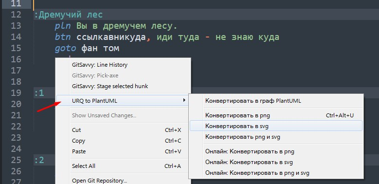
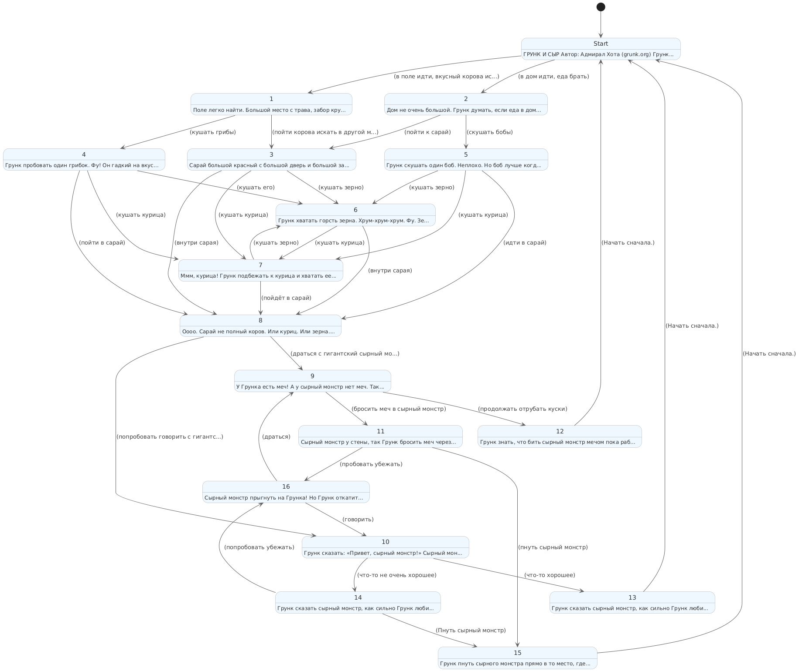

# URQ to PlantUML 🎯

> Конвертер файлов *qst* в диаграммы *PlantUML* для *Sublime* Text

## Что это такое?

Это плагин для *Sublime*, который берет ваши *.qst* файлы (*URQ* квесты) и превращает их в красивые графы. Потому что так делал Виктор Корянов, но без *Sublime*. И без *PlantUML*. И без одеколон.

## Зачем это нужно?

Представьте: у вас есть квест с кучей локаций, переходов и развилок. Вы пытаетесь понять логику, но в голове каша. Представили? Теперь забудьте. Каша будет не только в голове, но и на вашем экране в формате *png* или *svg*.

Для этого и нужен этот плагин. Плюс, просто прикольно смотреть на свой квест в виде схемы.

## Пример


```urql
:Фальстарт
:Фальстарт
:Фальстарт
:Фальстарт

:Старт
   pln Пример текста стартовой локации
   btn 1, иди направо
   btn 2, иди налево
   end

:Дремучий лес
   pln Вы в дремучем лесу.
   btn ссылкавникуда, иди туда - не знаю куда
   goto фан том
   end


:1
   pln Вы пришли в лес.
   goto Дремучий лес
   end


:2
   pln Вы пришли к высокой горе.
   end

:Фальстарт
end

:Lostinvane
end
```

## Фичи

- 🎨 **Разноцветно!** - локации раскрашены по смыслу: концовки зеленым 🟢, дубликаты и фантом красным 🔴, циклы (метки со ссылками сами на себя) - желтым 🟡; пунктирные стрелки - неявные переходы `⋯>` (авто-переходы, возврат *proc*, фантомные ссылки), синие стрелки - кнопки с пустыми надписями ➡️
- 🎨 **Разноцветно!** - локации раскрашены по смыслу: концовки зеленым 🟢, дубликаты и фантом красным 🔴, циклы (метки со ссылками сами на себя) - желтым 🟡; пунктирные стрелки - неявные переходы `⋯>` (авто-переходы, возврат *proc*, фантомные ссылки, меню), синие стрелки - кнопки с пустыми надписями ➡️, кнопки-меню (%) помечены иконкой курсора 🖱️, локальные кнопки (!) помечены иконкой закладки 🔖 и выглядят более блекло.
- 👻 **Фантомные ссылки** - даже битые ссылки по своему красивы и ведут в псевдолокацию *//phantom* 🔴
- 🧦 **Забытые метки** - локации, куда не ведут никакие ссылки хорошо видно, потому что они висят отдельно
- 🌍💻 **Онлайн и оффлайн** - работает как локально (нужно иметь *plantuml.jar* и *java*), так и через веб-сервис
- 🔑 **Варианты** - есть возможность создать граф как из *.qst*, так и из *.puml*, есть возможность отдельно создать только сырой *puml*-файл
- 🖼️ **PNG и SVG** - можно конвертировать и так и сяк (созданный файл откроется автоматически в программе по умолчанию)
- 📁 **Все в одном месте** - файлы *.puml*, *.svg* или *.png*, одноименные файлу *.qst*, создаются в той же самой папке
- 🐞 **Отладка игры** - если открыть консоль в *Sublime* (**Ctrl +`**), то можно увидеть какие фантомные локации были не найдены и какие локации дублируются
```
==================================================================
URQ Parser Warning: Найден дубликат метки: 'Локация' на строке 6
URQ Parser Warning: Найден дубликат метки: 'Локация' на строке 8
PlantUML Gen Warning: Локация 'ссылка' для btn из '3' не найдена
PlantUML Gen Warning: Локация 'метка' для btn из '3' не найдена
PlantUML Gen Warning: Локация 'ссылка' для btn из '3' не найдена
PlantUML Gen Warning: Локация 'метка' для btn из '3' не найдена
==================================================================
```
- ⌨️ **Горячие клавиши** - а файле *Default.sublime-keymap* можно прописать горячую клавишу (сейчас **Ctrl+Alt+u**) для запуска конвертации из открытого в *Sublime* *qst*-файла.
- 🖱️ **Контекстное меню** - можно запускать все команды из контекстного меню. Пункт *URQ to PlantUML*. Также работают кноманды из стандартной палитры *Sublime* (**Ctrl+Shift+p**), надо начать печатать `qst: `.



## Ограничения

- Размер *png* файла ограничен 4096x4096 px, для больших графов лучше использовать формат *svg*
- Большие файлы можно сделать только локально, но это проблема веб-сервиса, а не данного плагина
- На данный момент поддерживаются только: *метки*, *goto*, *btn*, *proc*, *end*, ссылки, фантомные ссылки, пустые ссылки
- % и ! кнопки/ссылки поддерживются, но выглядят как обычные кнопки
- Подстановки `#$` `#%$` не поддерживаются, переход на `#%метка$` будет распознан как фантомный
- Тестирование проводилось только на *Windows*

## Как установить?

1. Скачиваете архив с **URQ2PUML**. 
2. Распаковываете и кидаете его в папку с плагинами *Sublime Text*:
   - **Windows**: `%APPDATA%\Sublime Text\Packages\`
   - **Mac**: `~/Library/Application Support/Sublime Text/Packages/`
   - **Linux**: `~/.config/sublime-text/Packages/`
3. Открываете *qst* и жмете **Ctrl+Alt+u** или выбираете пункт в контекстном меню.
4. Profit! 📈


### Для работы с локальным PlantUML:
1. Устанавливаете *Java* (если еще не установлена или не прописана в *PATH*)
2. Скачиваете *PlantUML JAR* с сайта [PlantUML](https://PlantUML.com/download)
3. Кладете *jar* в папку *URQ2PUML* (либо указываете путь до *jar* файла в переменной *PUML_JAR_PATH* в *URQ2PUML.py*)

